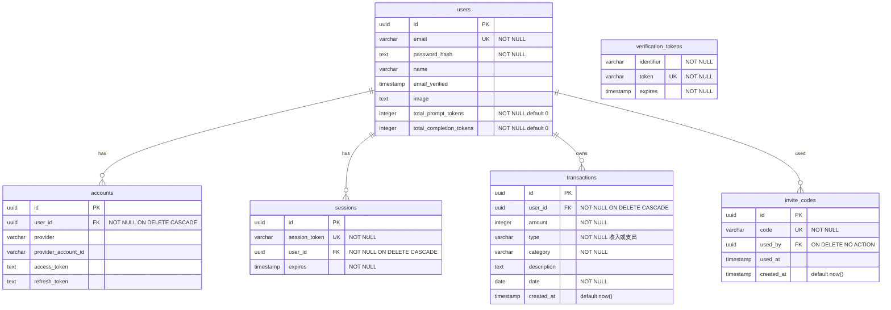

# 資料庫設計說明

> 這份文件說明 BookKeepingDemo 的資料庫長什麼樣、**為什麼**長這樣，以及目前已知的限制。
> 對應程式碼：[`server/database/schema.ts`](../server/database/schema.ts)（結構定義）、
> [`server/database/migrations/`](../server/database/migrations/)（實際套用到資料庫的 SQL）、
> [`server/api/chat.post.ts`](../server/api/chat.post.ts)（幾乎所有查詢都在這裡）。
> CI 會用 [`.github/sql/`](../.github/sql/) 底下兩支腳本，對一個真的 PostgreSQL 驗證本文描述的每一條設計。

---

## 1. 全貌

- **DBMS**：PostgreSQL 16（正式環境是 Neon 的 serverless Postgres）
- **存取方式**：[Drizzle ORM](https://orm.drizzle.team/)，schema 用 TypeScript 定義，型別直接餵給查詢
- **Migration 工具**：drizzle-kit
- **表數量**：6 張，分成兩組來源



| 表 | 來源 | 用途 | 目前實際用到嗎 |
|---|---|---|---|
| `users` | Auth.js + 自訂欄位 | 帳號主檔；額外掛了兩個 AI token 累計欄位 | ✅ |
| `accounts` | Auth.js 規定 | OAuth 第三方帳號綁定 | ❌ 目前只有帳密登入，表是空的 |
| `sessions` | Auth.js 規定 | DB session | ❌ 目前 session 策略是 JWT，不落地 |
| `verification_tokens` | Auth.js 規定 | Email 驗證信 / magic link | ❌ 尚未啟用 |
| `transactions` | 業務 | 記帳明細，本專案的核心表 | ✅ |
| `invite_codes` | 業務 | 邀請碼註冊控管 | ✅ |

**為什麼留著三張空表**：`@auth/drizzle-adapter` 的 adapter 介面要求這四張表都存在，缺一張它在初始化時就會爆。日後要接 Google 登入或改用 DB session，不用再動 schema。代價是資料庫裡有三張永遠是空的表——這是接現成 adapter 的固定成本，不是設計失誤。

---

## 2. 每個設計決策，以及它的代價

### 2.1 主鍵用 UUID，不用自增整數

```ts
id: uuid('id').defaultRandom().primaryKey()
```

| | 自增整數 (`serial`) | UUID |
|---|---|---|
| 空間 | 4–8 bytes | 16 bytes |
| 可否從 URL 猜到別人的資料 | 可以（`/tx/123` → 試 `124`） | 不行 |
| 插入時的索引行為 | 永遠往 B-tree 最右邊塞，熱點集中但頁面填得滿 | 隨機落點，容易造成頁面分裂與碎片 |
| 能不能在寫入資料庫前就決定 ID | 不行 | 可以（前端／多來源合併都方便） |

這裡選 UUID 的主因是 **transaction ID 會經過 AI 的手**：`updateTransaction` / `deleteTransaction` 是把 ID 交給模型、再由模型回傳，可預測的連號 ID 等於把「猜一個別人的 ID」變成一件容易的事。代價是索引比較肥、隨機寫入對 B-tree 不友善——在這個資料量級（單人幾千筆）完全無感，但如果變成每天百萬筆寫入，就該考慮 UUIDv7 這種「前綴帶時間、單調遞增」的折衷。

> 補充：`defaultRandom()` 產生的是 UUIDv4，Postgres 端是 `gen_random_uuid()`，13 版之後內建，不需要 `pgcrypto` extension。

### 2.2 金額用 `integer`，不用 `numeric`，更不用浮點數

```ts
amount: integer('amount').notNull()
```

**絕對不能用 `float` / `double`**：`0.1 + 0.2 !== 0.3`，錢一旦用二進位浮點數存，對帳就會出現無法解釋的一分錢差異。這是金融資料的基本紅線。

正統做法是 `numeric(12, 2)`（精確十進位小數）。這裡選 `integer` 是因為記帳情境的金額**以「元」為最小單位**，台幣日常消費不會出現小數點。好處是運算快、`SUM()` 不需要處理精度。

代價很明確：

- 不支援小數，要記 99.5 元只能記 99 或 100
- `integer` 上限約 21 億，單筆金額超過就會溢位
- 未來要支援外幣或以「分」為單位，得做一次型別 migration

如果要改，正確的方向不是改成 float，而是**改存「分」的整數**（`amount_cents`）或 `numeric(12,2)`。

### 2.3 交易日期用 `date`，建立時間用 `timestamp`

```ts
date: date('date', { mode: 'string' }).notNull(),
createdAt: timestamp('created_at', { mode: 'date' }).defaultNow(),
```

這兩個是不同的東西，刻意分開：

- `date`：**業務上的日期**。「這筆午餐是哪一天花的」沒有時分秒，也不該有時區。用 `date` 型別，`WHERE date BETWEEN '2026-09-01' AND '2026-09-30'` 直接就是想要的語意，不用擔心「9/30 23:30 算不算九月」這種邊界問題。
- `created_at`：**系統上的時間戳**。這筆紀錄是什麼時候被寫進資料庫的，屬於稽核資訊，跟業務日期無關（使用者今天可以補記上週的帳）。

`mode: 'string'` 讓 Drizzle 把 `date` 對應成 TypeScript 的 `string`（`'2026-09-01'`）而不是 `Date` 物件——因為 JS 的 `Date` 一定帶時區，一轉換就有機會偏移一天。這是 JS 生態處理日期最常見的坑。

> **已知限制**：`created_at` 用的是 `timestamp`（無時區），不是 `timestamptz`。伺服器換時區的話，既有資料的意義會跟著飄。新專案應該一律用 `timestamptz`。

### 2.4 `type` 和 `category` 用 `varchar`，沒有做成 lookup 表

正規化的教科書解法是開一張 `categories` 表，`transactions.category_id` 指過去。這裡刻意沒做，因為 **category 是 AI 生成的**：系統提示詞給了九個建議類別，但明確允許模型在合適時產生新類別。要是綁死外鍵，模型每創一個新詞就會寫入失敗。

代價（都是正規化本來要解掉的問題）：

- 同一個概念可能存成「餐飲」和「飲食」兩種字串，統計就會拆開
- 要把所有「飲食」改名成「餐飲」，得 `UPDATE` 全表
- 沒有辦法在資料庫層限制合法值

現在靠兩件事補：系統提示詞收斂用詞，以及 `queryTransactions` 每次都回傳 `SELECT DISTINCT category` 的清單給模型做模糊比對（見 [`chat.post.ts`](../server/api/chat.post.ts)）。**這是把資料完整性的責任從資料庫移到應用層**，是有意識的取捨，不是疏漏。

`type` 只有「收入」「支出」兩個值，本來很適合用 `CHECK` 約束或 PostgreSQL 的 `enum` 型別。目前是 `varchar(10)` 加上**應用層驗證**（`updateTransaction` 只接受這兩個字串）。這條算是可以補強的地方——加一條 `CHECK (type IN ('收入','支出'))` 成本極低。

### 2.5 外鍵的刪除行為：三條 CASCADE、一條 NO ACTION

| 外鍵 | 刪除行為 | 理由 |
|---|---|---|
| `accounts.user_id` | `CASCADE` | 帳號綁定是使用者的附屬資料，人走了就該一起清掉 |
| `sessions.user_id` | `CASCADE` | 同上，留著等於留下可用的登入憑證 |
| `transactions.user_id` | `CASCADE` | 記帳明細只對本人有意義；也符合「刪帳號即刪個資」 |
| `invite_codes.used_by` | `NO ACTION` | **刻意不同**：邀請碼是稽核紀錄 |

最後一條值得展開。邀請碼記錄的是「這組碼被誰、在什麼時候用掉了」——這是發放軌跡，不是使用者的個人資料。如果設成 `CASCADE`，刪一個使用者會連帶把邀請碼的使用紀錄洗掉，那組碼看起來就變成從沒被用過。設成 `SET NULL` 也不好，會留下「被用過但不知道被誰用」的半殘紀錄。

`NO ACTION` 的實際效果是：**資料庫會拒絕刪除一個已經用掉邀請碼的使用者**，強迫呼叫端明確處理（例如先把邀請碼歸檔）。這是用外鍵把一個業務規則寫死在資料庫層，讓它不可能被某支忘記處理的程式繞過。

CI 的 `behaviour-checks.sql` 段落 G 和 H 就在驗這兩種行為真的成立。

### 2.6 Token 用量存成 `users` 上的累計欄位

```ts
totalPromptTokens: integer('total_prompt_tokens').notNull().default(0),
totalCompletionTokens: integer('total_completion_tokens').notNull().default(0),
```

更「正確」的做法是開一張 `api_usage` 事件表，每次呼叫寫一筆，要總量時 `SUM()`。那樣可以看趨勢、可以按日切、可以追哪一則對話特別貴。

這裡選累計欄位，是因為現階段只需要「這個使用者總共燒了多少 token」這一個數字，而且更新是在資料庫端原子完成的：

```ts
.set({ totalPromptTokens: sql`${users.totalPromptTokens} + ${result.usage.promptTokens}` })
```

注意寫法是 `SET col = col + n`，**不是**先讀出來、在 JS 加完再寫回去。後者在兩個請求同時進來時會遺失更新（lost update）；前者由 Postgres 在該列的行鎖底下完成，天然安全。這是「把運算推到資料庫端」最典型、也最實用的一個例子。

代價：資訊被壓縮掉了，只剩總量，回不去明細。要做用量分析就得補事件表。

---

## 3. 索引

```ts
index('idx_transactions_user_date').on(table.userId, table.date),
index('idx_transactions_user_category').on(table.userId, table.category),
```

### 3.1 為什麼是複合索引，而且 `user_id` 一定在前面

這是個多租戶（multi-tenant）的應用：**每一支查詢，無一例外，第一個條件都是 `user_id = 當前使用者`**。

PostgreSQL 的 B-tree 複合索引遵循**最左前綴（leftmost prefix）**規則——索引 `(a, b)` 可以服務 `WHERE a = ?`、`WHERE a = ? AND b = ?`、`WHERE a = ? AND b BETWEEN ? AND ?`，但**不能**有效服務只有 `WHERE b = ?` 的查詢。

因為索引在物理上就是照 `(a, b)` 的順序排好的：先按 a 排，a 相同的再按 b 排。像電話簿先按姓再按名——知道姓可以馬上翻到那一區，只知道名字就得整本翻。

所以順序寫成 `(user_id, date)` 而不是 `(date, user_id)`，是因為前者能同時服務「某使用者的全部」和「某使用者的某段期間」，後者只能服務後者。**這個順序寫反是最常見的索引設計錯誤之一**，CI 的 `schema-assertions.sql` 段落 2 就在盯這件事。

### 3.2 每條索引服務哪支查詢

`idx_transactions_user_date` → 所有帶日期範圍的查詢，也就是 `queryTransactions` 的主路徑：

```sql
SELECT category, sum(amount), count(*)
  FROM transactions
 WHERE user_id = $1
   AND date BETWEEN $2 AND $3
 GROUP BY category;
```

`idx_transactions_user_category` → 指定類別、但不特別在意日期範圍選擇性的查詢：

```sql
SELECT * FROM transactions
 WHERE user_id = $1 AND category = $2;
```

CI 的 `behaviour-checks.sql` 段落 F 會灌 5000 筆資料、跑 `ANALYZE`，再用 `EXPLAIN (FORMAT JSON)` 確認這兩支查詢的執行計畫**真的**選到對應的索引，而不只是索引存在而已。

### 3.3 為什麼沒有更多索引

索引不是免費的：每一條索引都要佔空間，而且**每次 INSERT / UPDATE / DELETE 都得同步維護**。寫入密集的表加太多索引，寫入會被拖慢。

沒有加的幾條，以及理由：

- **單獨的 `date` 索引**：沒有「跨所有使用者查某天」的需求，加了沒人用
- **`type` 索引**：只有兩個值，選擇性極差（每個值命中一半的資料），Postgres 大概率會直接無視它去做全表掃描
- **`description` 全文索引**：目前沒有關鍵字搜尋功能，要做才加

---

## 4. 查詢模式

所有業務查詢集中在 [`server/api/chat.post.ts`](../server/api/chat.post.ts) 的 function-calling 分派裡。

### 4.1 資料隔離靠應用層，不是靠資料庫

每一支查詢都硬帶 `eq(transactions.userId, userId)`，而 `userId` 來自伺服器端的 session（`getServerSession`），**不是從請求 body 讀的**。這點很重要：如果讓前端傳 userId，等於讓任何人改個參數就能看別人的帳。

```ts
const session = await getServerSession(event)
const userId = (session?.user as { id?: string } | undefined)?.id
if (!userId) throw createError({ statusCode: 401, statusMessage: '請先登入' })
```

**這個做法的弱點**：隔離是靠「每支查詢的作者都記得加 where」來維持的。漏掉一支就是資料外洩，而資料庫不會阻止你。更強的做法是 PostgreSQL 的 **Row-Level Security（RLS）**——在資料庫層宣告「這張表的每一列只有 owner 看得到」，即使應用層忘了加條件也撈不到。本專案目前沒有做 RLS，CI 的段落 D 用一個「Alice 查不到 Bob 的資料」的斷言來當作最低限度的迴歸保護。

### 4.2 修改與刪除採「先驗證擁有權，再動手」

```ts
const existing = await db.query.transactions.findFirst({
  where: and(eq(transactions.id, txId), eq(transactions.userId, userId)),
})
if (!existing) return { error: '找不到這筆記錄' }

await db.update(transactions).set(updates).where(eq(transactions.id, txId))
```

兩次往返資料庫。比較省的寫法是一次搞定，把擁有權條件直接放進 `WHERE`：

```ts
const [updated] = await db.update(transactions)
  .set(updates)
  .where(and(eq(transactions.id, txId), eq(transactions.userId, userId)))
  .returning()
if (!updated) return { error: '找不到這筆記錄' }
```

這樣既少一次往返，也**沒有中間的時間差**（現在的寫法在「查完」到「改完」之間，理論上存在一個競態窗口）。目前保留兩段式是為了能區分「不存在」和「不是你的」給出不同訊息，但實務上這兩者本來就該回同一個錯誤——免得洩漏「這個 ID 存在，只是不屬於你」。**這是一條值得改的。**

### 4.3 聚合運算放在資料庫端

三種 `groupBy` 都是讓 Postgres 做 `SUM` / `COUNT` / `GROUP BY`，只把彙總結果傳回來：

```ts
.select({
  category: transactions.category,
  total: sql<number>`sum(${transactions.amount})`.as('total'),
  count: sql<number>`count(*)`.as('count'),
})
.groupBy(transactions.category)
```

不是撈全部回 Node 再用 `reduce` 加總。差別在資料量大的時候很致命：前者網路上只傳幾列，後者傳幾千列。**「能在資料庫做完的聚合就不要搬到應用層」**是效能上最基本的一條。

順帶一提，`sql` 樣板字串裡的值會被 Drizzle 轉成**參數化查詢**（`$1`、`$2`），不是字串拼接，所以沒有 SQL injection 的問題。

### 4.4 N+1 在這裡不存在，但值得知道為什麼

N+1 是指「先查一批父資料（1 次），再迴圈對每一筆查子資料（N 次）」。本專案的查詢都是單表、單次往返，沒有這個問題。

如果未來加了「交易 → 標籤」的關聯，就會踩到：查 100 筆交易後，迴圈裡對每筆查標籤 = 101 次查詢。解法是 `JOIN` 一次撈完，或用 `WHERE tag.tx_id IN (...)` 批次撈（Drizzle 的 `with` 關聯查詢會自動做後者）。

---

## 5. Migration

drizzle-kit 有三個容易搞混的指令：

| 指令 | 做什麼 | 什麼時候用 |
|---|---|---|
| `npx drizzle-kit generate` | 比對 `schema.ts` 和 `migrations/` 的快照，**產生**新的 SQL 檔，不碰資料庫 | 每次改完 `schema.ts` |
| `npx drizzle-kit migrate` | 把還沒套用的 SQL 檔**依序套用**到資料庫，並記錄在 `__drizzle_migrations` 表 | 部署時、CI、隊友拉了新 code 之後 |
| `npx drizzle-kit push` | 直接把 `schema.ts` 的樣子**同步**到資料庫，不產生 migration 檔 | 只在本機亂玩的時候 |

**正式環境永遠用 `generate` + `migrate`，不要用 `push`。** 理由是 `push` 沒有留下版本紀錄：沒辦法知道某個環境套到哪一版、沒辦法 code review 那段 SQL、沒辦法在會遺失資料的變更（例如刪欄位、改型別）發生前先看到它。`migrate` 則是每個檔案套用一次、有紀錄、可以在 PR 裡被人審。

`migrations/meta/_journal.json` 記的是「有哪些 migration 檔、順序如何」，`0000_snapshot.json` 是當時 schema 的完整快照——`generate` 靠它算出差異。**這兩個檔案必須跟著 SQL 一起提交**，否則下一次 `generate` 會算錯。

### 為什麼 CI 要檢查 drift

`schema.ts` 改了、忘記跑 `generate` 是很常見的失誤：本機用 `push` 或 Drizzle Studio 玩過，資料庫看起來是對的，但 migration 檔沒更新。等到部署到乾淨環境，表就少了一欄。

CI 的 `schema-drift` job 做的事很簡單：跑一次 `generate`，如果它產生了任何新檔案，代表 `schema.ts` 和 `migrations/` 對不上，直接讓 CI 紅。

---

## 6. 連線方式

```ts
// server/utils/db.ts
import { neon } from '@neondatabase/serverless'
import { drizzle } from 'drizzle-orm/neon-http'

const sql = neon(process.env.POSTGRES_URL!)
export const db = drizzle(sql, { schema })
```

用的是 Neon 的 **HTTP driver**，不是傳統的 TCP 連線。這是為了配合 serverless 部署（Vercel）的形態：

- **傳統做法**：程式啟動時建一個連線池，連線重複使用。前提是「程式會一直活著」。
- **Serverless 的問題**：每個請求可能是一個全新的執行實例，各自開連線。流量一上來，Postgres 的 `max_connections`（預設 100）馬上被打爆。
- **HTTP driver 的解法**：每次查詢就是一個獨立的 HTTPS 請求，**沒有連線狀態**，也就沒有連線數爆掉的問題。連線池的工作由 Neon 那端的 proxy 負責。

代價，而且是實質的代價：

1. **不支援多語句交易（transaction）**。HTTP driver 每個請求各自獨立，沒有辦法 `BEGIN ... COMMIT` 跨越多次查詢。這直接造成了下一節的第一條限制。
2. 每次查詢都有 HTTP 的額外開銷，連續多次小查詢比 TCP 慢。
3. 沒有 `LISTEN` / `NOTIFY`、沒有 prepared statement 重用。

要拿回交易能力，可以換成 `@neondatabase/serverless` 的 **WebSocket** 模式（`Pool` + `drizzle-orm/neon-serverless`），或在非 serverless 環境改用 `pg`。

> 順帶說明：`package.json` 的 devDependency 有一個 `pg`，那**不是**給應用程式用的，是 drizzle-kit 在本機和 CI 對一般 PostgreSQL 執行 migration 時需要的 driver。沒有它，drizzle-kit 會退而選用 Neon 的 websocket driver，連不上 CI 裡的 `postgres:16` 容器。

---

## 7. 已知限制

誠實列出來，這些都是真的、不是假設：

### 7.1 註冊流程沒有交易保護 ⚠️ 最嚴重的一條

[`server/api/auth/signup.post.ts`](../server/api/auth/signup.post.ts) 做三件事：

1. 查邀請碼是否存在且未使用
2. 建立使用者
3. 把邀請碼標記為已使用

這三步**沒有包在同一個 transaction 裡**（因為上一節說的 HTTP driver 不支援）。後果是典型的 **check-then-act 競態條件**：兩個人同時拿同一組邀請碼註冊，兩邊都在步驟 1 讀到「未使用」，於是兩個帳號都建立成功，一組邀請碼被用了兩次。

還有一個更難處理的情況：步驟 2 成功、步驟 3 失敗（網路中斷），使用者建好了但邀請碼還顯示可用。

**正確的修法**（依代價由低到高）：

- **原子性的條件更新**：把「檢查」和「標記」合成一句，靠資料庫自己保證只有一個人成功

  ```sql
  UPDATE invite_codes SET used_by = $1, used_at = now()
   WHERE code = $2 AND used_by IS NULL
  RETURNING id;
  ```

  沒有回傳列 = 沒搶到，直接拒絕。這招不需要交易，成本最低。
- **改用支援交易的 driver**（WebSocket 或 `pg`），三步包成一個 transaction
- **`SELECT ... FOR UPDATE`** 鎖住那一列再處理（同樣需要交易）

### 7.2 其他

| 限制 | 影響 | 可能的解法 |
|---|---|---|
| 查詢沒有 `LIMIT` / 分頁 | 使用者資料多的時候，「查全年」會把整年的列全撈回來，再整包塞給 AI | 加 `LIMIT` + 游標分頁；沒有 groupBy 時強制上限 |
| 沒有 Row-Level Security | 資料隔離全靠應用層記得加 `where` | 開 RLS policy，把隔離下沉到資料庫 |
| `created_at` 用 `timestamp` 而非 `timestamptz` | 跨時區部署時語意會飄 | migration 改型別 |
| `type` 沒有 `CHECK` 約束 | 資料庫層允許任意字串 | `CHECK (type IN ('收入','支出'))` |
| `category` 未正規化 | 同義詞會拆散統計；改名要全表 UPDATE | 視需求決定是否值得引入 lookup 表 |
| `amount` 是 `integer`（元） | 不支援小數；上限約 21 億 | 改存「分」或 `numeric(12,2)` |
| 沒有軟刪除 / 稽核軌跡 | 刪掉就真的沒了，AI 誤刪無法復原 | 加 `deleted_at`，查詢一律過濾 |
| `selectDistinct` 每次查詢都跑一次 | 資料量大時是一次額外的掃描 | 快取類別清單，或另建索引 |
| 三張 Auth.js 表是空的 | 佔位，無實際影響 | 啟用 OAuth 或 DB session 時才會用到 |

---

## 8. CI 怎麼驗這些

`.github/workflows/ci.yml` 的 `database` job 會：

1. 起一個真的 `postgres:16` service container
2. 跑 `drizzle-kit migrate` 把 migration 套上去
3. 跑 [`.github/sql/schema-assertions.sql`](../.github/sql/schema-assertions.sql) —— 驗**結構**：6 張表、2 條索引（含**欄位順序**）、4 條外鍵（含刪除行為）、4 條唯一約束、10 個 NOT NULL 欄位
4. 跑 [`.github/sql/behaviour-checks.sql`](../.github/sql/behaviour-checks.sql) —— 驗**行為**：唯一約束擋得住重複註冊、外鍵擋得住孤兒資料、多租戶隔離有效、聚合結果正確、索引真的被查詢計畫選用、CASCADE 真的連動刪除、邀請碼的 NO ACTION 真的擋住刪除
5. 再跑一次 `migrate`，確認重複執行是 no-op
6. 再驗一次結構

外加一個獨立的 `schema-drift` job，確保 `schema.ts` 的任何改動都有對應的 migration 檔。

用真的 PostgreSQL 而不是 mock，是因為這裡要驗的每一件事——外鍵行為、索引被不被選用、migration 能不能套用——**只有真的資料庫執行過才算數**。

`behaviour-checks.sql` 整支包在 `BEGIN` / `ROLLBACK` 之間，跑完不留任何測試資料。

---

## 9. 名詞速查

| 名詞 | 在這個專案裡的具體對應 |
|---|---|
| 主鍵 (PK) | 每張表的 `id`，UUID |
| 外鍵 (FK) | `transactions.user_id` → `users.id`，資料庫保證不會有指向不存在使用者的交易 |
| 唯一約束 (UNIQUE) | `users.email`、`invite_codes.code` |
| 複合索引 | `(user_id, date)`、`(user_id, category)` |
| 最左前綴 | `(user_id, date)` 服務得了「只給 user_id」，服務不了「只給 date」 |
| B-tree | PostgreSQL 預設的索引結構，平衡樹，範圍查詢（`BETWEEN`）和等值查詢都快 |
| 正規化 / 反正規化 | `category` 存字串是刻意的反正規化，換來 AI 生成類別的彈性 |
| 交易 (transaction) | ⚠️ 本專案目前**沒有**用到，因為 HTTP driver 不支援——見 §7.1 |
| 競態條件 (race condition) | 邀請碼的 check-then-act，見 §7.1 |
| 遺失更新 (lost update) | token 累計用 `SET col = col + n` 避開了，見 §2.6 |
| 多租戶隔離 | 每支查詢帶 `user_id`，見 §4.1 |
| 查詢計畫 (`EXPLAIN`) | CI 用它確認索引真的被用到，見 §3.2 |
| Migration | `generate` 產生、`migrate` 套用，見 §5 |
